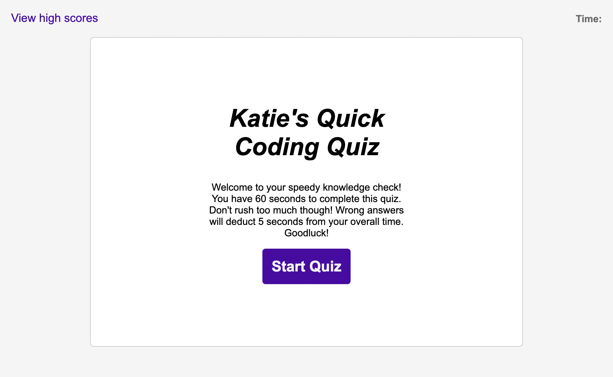

# Code Quiz

## Description

- The Code Quiz repository was created to build a dynamic and interactive quick quiz from scratch.
- This project was created to strengthen my proficiency working with HTML structuring, CSS styling and JavaScript functioning through application and practice, so that I may build a strong foundation in Java to create dynamic and functional applications that run seamlessly in future more complicated work. 
- The Code Quiz application can be used to help test yourself in a time sensitive setting on your coding knowledge and coded such that questions and time can be added in the future to make it more extensive.   
- Creating Katie's Quick Coding Quiz provided considerable opportunities to troubleshoot and debug code, utlilize the DOM Web API and pracice executing proper JavaScript syntax.

### Page Preview

### Link to Application

[View in browser](https://katiebutler37.github.io/code-quiz/)

